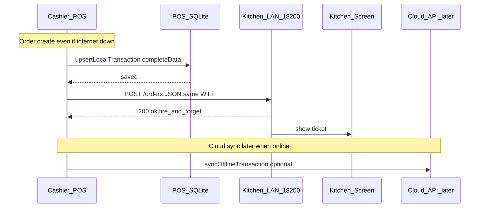
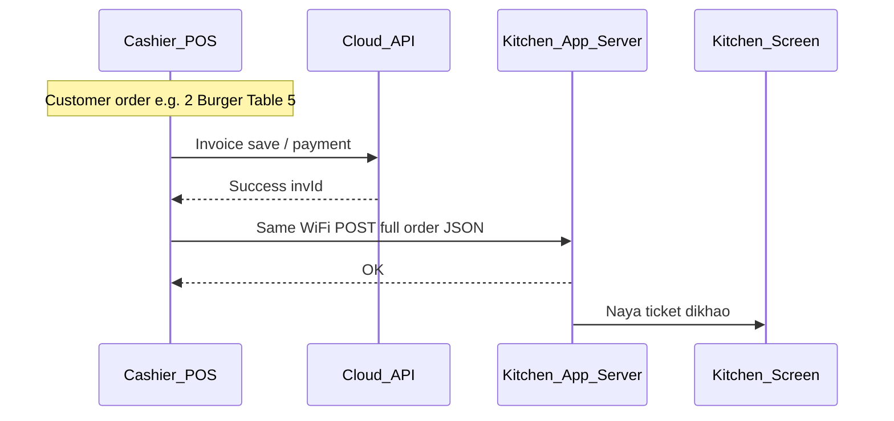

  # POS → Kitchen Local Flow

Yeh document batata hai ke POS pe order create hone ke baad kitchen screen pe ticket kaise aati hai.
Baad mein implement / test / onboarding ke liye use karo.

**Related plan:** Cursor plan `POS Kitchen Local Server`  
**Repos:** `pos-flutter` (cashier) + `flovix-kitchen` (kitchen display)  
**Phase 1 scope:** Kitchen pe order receive + display only (status sync baad mein)

---

## Offline POS + Kitchen (important)

Tumhari POS **offline-first** hai: order pehle device ke SQLite mein save hota hai; cloud sync baad mein (internet aaye to).

**Kitchen local server internet pe depend nahi karta.** Same Wi‑Fi / LAN kaafi hai.



### Local server kaise “create” hota hai?

POS pe server nahi banta. **Kitchen app** start hote hi apne andar HTTP server on karti hai:

- Bind: `0.0.0.0:18200` (LAN pe sunti hai)
- Header pe **real LAN IP** dikhega (e.g. `http://192.168.1.50:18200`) — Copy button se copy karo
- **Kabhi `127.0.0.1` mat use karo** POS KDS Settings mein — woh sirf usi device pe kaam karta hai, dusri kitchen/POS se nahi
- POS → Settings → **KDS Settings** mein har kitchen ka LAN URL alag row pe save karo
- Order save ke turant baad POS un URLs pe `POST /orders` broadcast karta hai

Matlab: **POS = client, har Kitchen device = apna server + screen** (same Wi‑Fi).


### Data sharing (kya share hota hai)

| Path | Kab | Data |
|------|-----|------|
| POS → SQLite | Order save | Poori invoice (`completeData`) offline list/sync ke liye |
| POS → Kitchen LAN | Same moment (fire-and-forget) | Mapped JSON: items, qty, notes, table, customer, totals |
| POS → Cloud | Baad mein jab online / sync | Accounting API — kitchen is se alag |

Kitchen ko **cloud se order nahi aata** (phase 1). Kitchen ko data **seedha POS se LAN** pe milta hai.

### Offline scenarios

1. **Internet band, Wi‑Fi on (dono apps same network)**  
   Order local save + kitchen ticket — dono kaam karenge.

2. **Internet band + kitchen app band / galat IP**  
   Order local save ho jayega; kitchen push fail (silent); cashier wait nahi karega.

3. **Kitchen URL settings mein khali**  
   Push skip — sirf offline invoice save.

4. **Baad mein internet aaya**  
   Offline sync cloud pe invoice bhejega; kitchen pe pehle se ticket ho chuki hogi (agar LAN push succeed hua).

### Ek line

**Offline mode = cloud optional. Kitchen sharing = same Wi‑Fi pe POS → Kitchen local server. Dono independent hain.**

---

## Multiple kitchens (broadcast — current)

Abhi mode **1 = poora order sab kitchens pe**:

```text
POS order save
   ├─► Kitchen Grill  :18200   (full order)
   ├─► Kitchen Bar    :18200   (full order)
   └─► Kitchen Prep   :18200   (full order)
```

POS → **Settings → KDS Settings** — har kitchen ka **alag URL field + Test kitchen** button:

1. Kitchen Display URL 1 → `http://192.168.1.50:18200` → Test kitchen  
2. Add kitchen → URL 2 → `http://192.168.1.51:18200` → Test kitchen  
3. Save KDS Settings  

(General tab mein kitchen URL nahi — alag **KDS Settings** tab hai.)

- Har kitchen app apna server chalaati hai (alag device / alag IP)
- Order save pe POS **parallel** sab URLs pe `POST /orders` bhejta hai
- Ek kitchen down ho to baaki phir bhi ticket paati hain; cashier block nahi
- Category split (sirf grill items grill pe) **baad** mein — abhi nahi

---

## Simple picture (restaurant)

1. Cashier (POS) order leta hai — e.g. “2 Burger, Table 5”
2. Invoice cloud / local pe save hoti hai (accounting)
3. Uske turant baad POS **same Wi‑Fi** pe Kitchen device ko order ka data bhejta hai
4. Kitchen app screen pe naya ticket dikhati hai

**Local server** = Kitchen app ke andar chhota HTTP server (port `18200`). Alag Node PC phase 1 mein zaroori nahi.

---

## Kaun kya hai?

| Cheez | Matlab |
|--------|--------|
| **POS app** (`pos-flutter`) | Cashier ki app — order yahan banta hai |
| **Kitchen app** (`flovix-kitchen`) | Kitchen display — tickets yahan dikhte hain |
| **Kitchen local server** | Kitchen app ke andar HTTP server (`0.0.0.0:18200`) |
| **Cloud API** | Existing online server — invoice save / reports |

---

## Step-by-step flow



### 1) Cashier POS pe order banata hai

Cart → payment / save order → existing `createInvoiceB` flow.

### 2) POS pehle cloud (ya offline local) pe invoice save karta hai

Accounting / reports ke liye — yeh pehle se chal raha hai.

### 3) Success ke baad POS kitchen ko message bhejta hai

Example URL (POS settings mein save hoga):

`http://192.168.1.50:18200/orders`

Body: full order JSON (items, qty, notes, table, customer, totals, payments).

Yeh **print nahi** — yeh **data** hai kitchen screen ke liye.

### 4) Kitchen app receive karti hai

App start hote hi server `18200` pe sun rahi hoti hai.  
Order aate hi KDS list mein naya card.

### 5) Cashier block nahi hota

Agar kitchen band / offline ho → POS order phir bhi save ho.  
Kitchen push fail → quietly retry (phase 1 light queue); cashier wait nahi kare.

---

## Devices (same Wi‑Fi / LAN)

```text
          Same Wi-Fi / LAN
  ┌─────────────────────────────┐
  │                             │
  │   POS Tablet                │   Kitchen Tablet
  │   192.168.1.20              │   192.168.1.50
  │                             │
  │  [Create Order]             │   [Local Server :18200]
  │       │                     │          ▲
  │       │  1) Cloud API       │          │
  │       ▼                     │          │
  │   Internet server           │          │
  │                             │          │
  │  2) POST /orders  ──────────┼──────────┘
  │     (LAN, fast)             │
  └─────────────────────────────┘
```

POS settings example: `http://192.168.1.50:18200`

---

## “Local server” ka matlab?

POS seedha dusri Flutter app ke UI ko call nahi kar sakta.  
Is liye Kitchen app background mein chhota HTTP server on karti hai:

| Endpoint | Purpose |
|----------|---------|
| `GET /health` | “main zinda hoon” — connection test |
| `POST /orders` | naya order queue + screen pe dikhao |

Idea similar hai print bridge (`18181`) jaisa, lekin yahan target **kitchen UI** hai, printer nahi — aur server **kitchen device** pe chalta hai.

---

## Shared order JSON (contract)

POS → Kitchen `POST /orders`:

```json
{
  "schema": 1,
  "event": "order.created",
  "sentAt": "2026-07-21T17:30:00Z",
  "branchId": "1",
  "counterId": "4",
  "invoice": {
    "localId": "...",
    "serverId": "3093",
    "number": "INV-1001",
    "table": "T-5",
    "customerName": "...",
    "orderType": "dine_in",
    "notes": "...",
    "createdAt": "..."
  },
  "items": [
    {
      "name": "Burger",
      "qty": 2,
      "notes": "no onion",
      "category": "Grill",
      "modifiers": []
    }
  ],
  "totals": { "subTotal": 40, "tax": 6, "total": 46 },
  "payments": [{ "method": "Cash", "amount": 46 }]
}
```

POS pe source: existing `createInvoice` / cart payload in `lib/screens/pos_add_payment_screen/pos_add_payment_screen.dart` — map once into kitchen schema.

---

## Decisions (locked)

- **Server host:** Kitchen app (`flovix-kitchen`), not POS
- **Payload:** Full invoice / order
- **MVP:** Receive + display only
- **Phase 2 later:** Kitchen → POS status (`preparing` / `ready` / `served`), multi-kitchen routing, auth secret

---

## One-line summary

**POS order banata hai → cloud/local pe save → usi waqt same Wi‑Fi pe Kitchen app ke local server (`:18200`) ko poori invoice bhejta hai → kitchen screen pe ticket aa jati hai.**

---

## Quick LAN test

1. Kitchen app start → header pe IP dikhega (e.g. `http://192.168.1.50:18200`)
2. Same Wi‑Fi se: `curl http://KITCHEN_IP:18200/health`
3. POS → Settings → **KDS Settings** → add each kitchen URL + Test → Save
4. POS pe order save/pay → kitchen card dikhe
5. Kitchen band → POS order phir bhi succeed; kitchen URL empty → push skip

Firewall: port `18200` LAN pe open.

### Implemented files

**Kitchen (`flovix-kitchen`):**
- `lib/services/kitchen/kitchen_local_server.dart` (+ io/stub)
- `lib/services/kitchen/kitchen_order_store.dart`
- `lib/services/kitchen/kitchen_order_model.dart`
- `lib/screens/kitchen/kitchen_display_screen.dart`
- Server starts in `main.dart` on port `18200`

**POS (`pos-flutter`):**
- `lib/services/kitchen/kitchen_local_client.dart`
- `lib/services/kitchen/kitchen_order_mapper.dart`
- `lib/services/kitchen/kitchen_server_prefs.dart`
- Hook after local save in `pos_add_payment_screen.dart`
- POS settings: **Settings → KDS Settings** (separate URL field + Test per kitchen)
